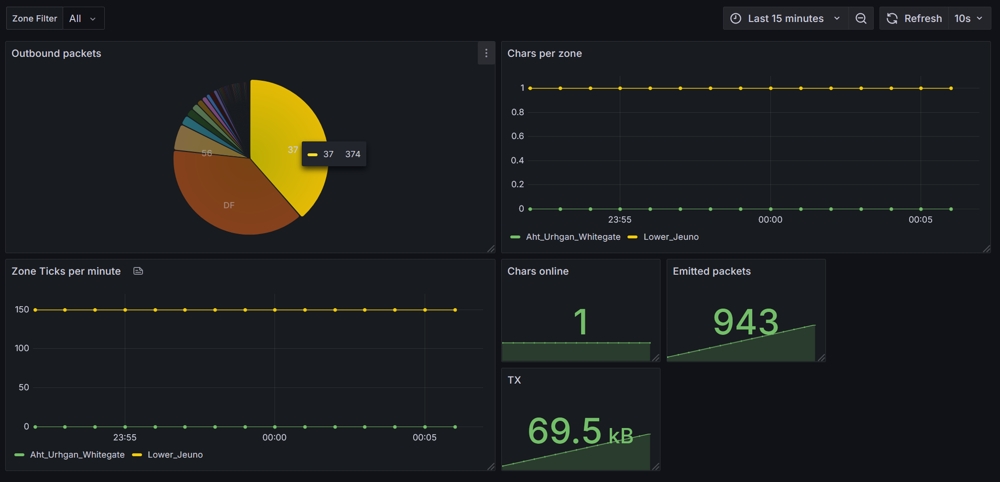
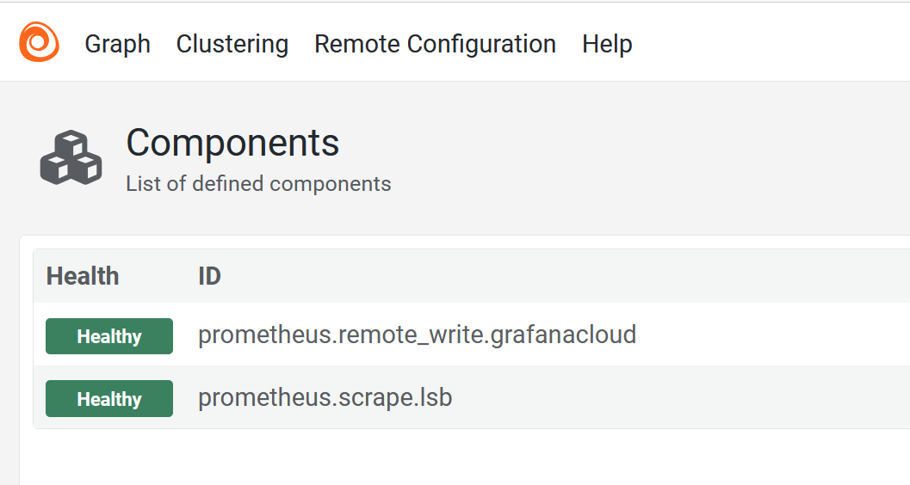
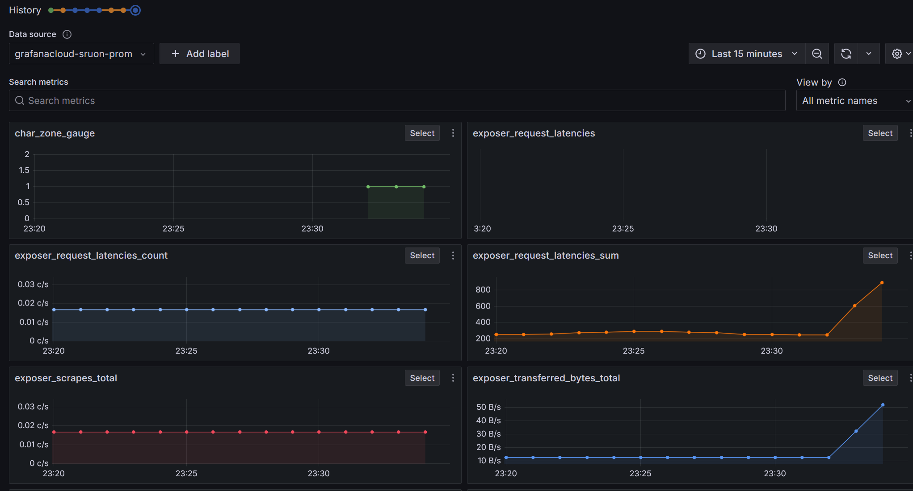
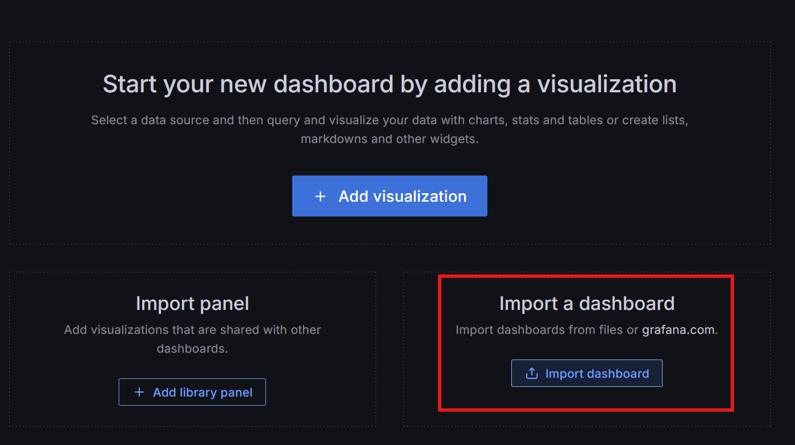

# LandSandBoat-prometheus
Prometheus metrics for LandSandBoat



## Getting Started
### Enabling the module
Clone this repository (as is or as a submodule) into the `modules` directory of your server.

```
git clone git@github.com:sruon/LandSandBoat-prometheus.git
# or
git submodule add git@github.com:sruon/LandSandBoat-prometheus.git
```
Modify the init.txt file in the root of the `modules` folder:

```
LandSandBoat-prometheus
```

### Configuration
The module can be configured by modifying the `settings/map.lua`.

This is not required if the default address and port work for you (127.0.0.0:8888)

```lua
xi.settings.map =
{
[...]
  -- Address to bind the exposer on
  PROMETHEUS_LISTEN_ADRESS = '0.0.0.0'
  
  -- Port to bind the exposer on
  PROMETHEUS_LISTEN_PORT = 2112
}
```

### Starting the server
Start the server and you should see this message in the logs

```
[map][error] Settings: Failed to look up key: map.PROMETHEUS_PORT, using default value: "0" (settings::get:157)
[map][warn] [prometheus] No listen port defined, listening on default port: 9865 (PrometheusModule::OnInit:74)
[map][error] Settings: Failed to look up key: map.PROMETHEUS_LISTEN_ADDRESS, using default value: "" (settings::get:157)
[map][warn] [prometheus] No listen address defined, listening on default address: 127.0.0.1 (PrometheusModule::OnInit:80)
[map][info] [prometheus] Exposer started. Visit http://127.0.0.1:9865/metrics (PrometheusModule::OnInit:86)
```  

### Accessing the metrics

The metrics are exposed on the `/metrics` endpoint of the server. You can access them by visiting `http://<ip>:<port>/metrics` in your browser.

By default, this is `http://127.0.0.1:9865/metrics`

```  
# HELP outgoing_packet_size_counter Counter for outgoing_packet_size
# TYPE outgoing_packet_size_counter counter
outgoing_packet_size_counter{packetType="37"} 672
outgoing_packet_size_counter{packetType="5E"} 180
outgoing_packet_size_counter{packetType="CC"} 176
# HELP packet_pushes_counter Counter for packet_pushes
# TYPE packet_pushes_counter counter
packet_pushes_counter{packetType="37"} 7
packet_pushes_counter{packetType="DF"} 5
packet_pushes_counter{packetType="D2"} 10
# HELP time_server_ticks_counter Counter for time_server_ticks
# TYPE time_server_ticks_counter counter
time_server_ticks_counter 230
# HELP zone_ticks_counter Counter for zone_ticks
# TYPE zone_ticks_counter counter
zone_ticks_counter{zoneName="Upper_Jeuno"} 26
# HELP char_zone_gauge Gauge for char_zone
# TYPE char_zone_gauge gauge
char_zone_gauge{zoneName="Upper_Jeuno"} 1
```

### Next steps

You can now configure any collector that supports Prometheus to scrape the metrics from your server and store them in your favorite datastore.

How to collect and visualize the metrics is **out of the scope of this module**, but you can find many resources online on how to do this.

An example showing how to use Grafana Alloy with Grafana Cloud is provided for convenience.

### Example: Grafana Alloy + Grafana Cloud
Examples show usage on Windows but should be extendable to other platforms with minor tweaks.

#### Sign up for a Grafana Cloud free account
- Head over to [Grafana Cloud](https://grafana.com/products/cloud/) and sign up for a free account
- Follow instructions until you get to your dashboard
- Click on the blue "Launch" button to access services
- Click on "Send Metrics" below "Prometheus" to get the URL and API key
- Keep this information handy for the next steps

#### Installing Grafana Alloy

Refer to [Grafana Alloy's documentation](https://grafana.com/docs/grafana-cloud/agent/installation/) for more information.

- Head over to the [releases page](https://github.com/grafana/alloy/releases)
- Download the file named "alloy-installer-windows-amd64.exe.zip"
- Extract the zip file
- Run the installer

Grafana Alloy should now be running as a background service.

The debug UI should be available at http://localhost:12345/

#### Configuring Grafana Alloy
Now we need to tell Grafana Alloy where to scrape the metrics from.

- Open the file `%PROGRAMFILES%\GrafanaLabs\Alloy\config.alloy`
  - You may need to delete the existing file and replace it with a new one.

Use the following configuration, and edit the appropriate fields with the information obtained from Grafana Cloud.
```
prometheus.remote_write "grafanacloud" {
endpoint {
url = "https://prometheus-xxx.grafana.net/api/prom/push"

    basic_auth {
      username = "xxx"
      password = "xxx"
    }
}
}

prometheus.scrape "lsb" {
    targets = [{
        __address__ = "127.0.0.1:9865",
    }]
    
    scrape_interval = "10s"
    
    forward_to = [prometheus.remote_write.grafanacloud.receiver]
}
```

Using the Service Manager, restart the Alloy service.

Head over to the Alloy debug UI and check the status of the scrape.



#### Opening Grafana

From Grafana Cloud, click the "Launch" button next to "Grafana".

After a couple moments, your Grafana instance should be ready.

Heading over to the "Explore" tab, you should be able to query the metrics scraped from your server.



#### Import dashboard
Import `dashboard.json` into Grafana to create a Dashboard showcasing basic concepts and displaying basic metrics exported by this project.

Dashboards can be imported in the "New Dashboard" dialog.



#### Next steps
From there you may want to do the following:
- Learn more Prometheus query language to get the most out of your metrics
- Create dashboards, mixing metrics as you like
- Set up alerts
- Tweak the scrape rate to submit metrics more frequently (default every minute)

#### Missing
- Support for multiple map processes
- Lua bindings to create arbitrary metrics
- Hooks into global Lua functions
- Incoming Packets
- Only a handful of labels are record at the time
